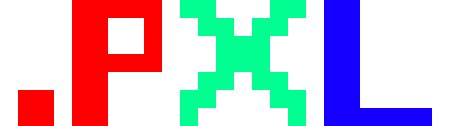
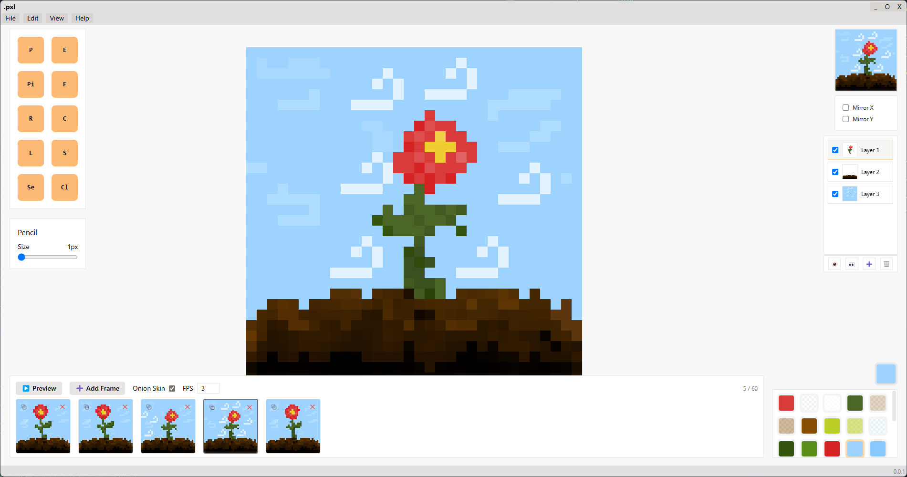
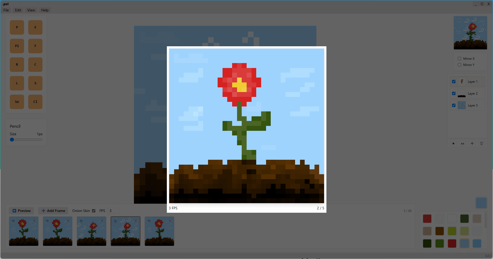
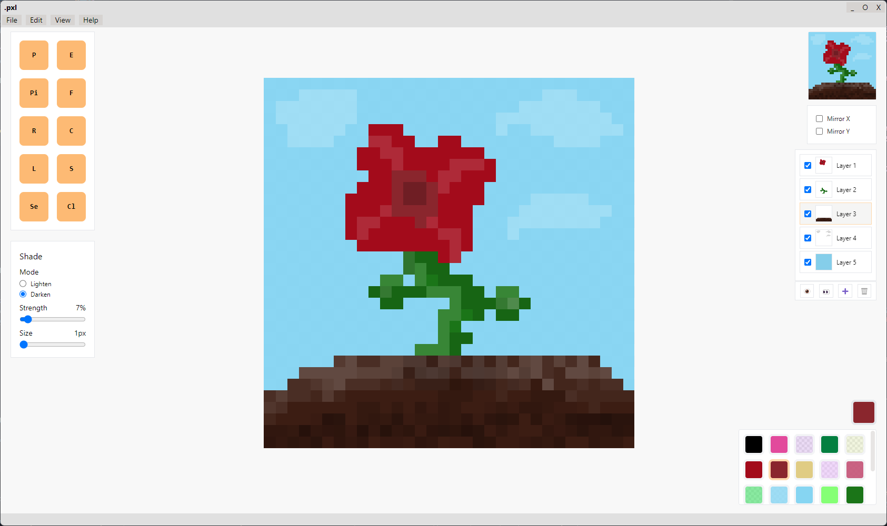
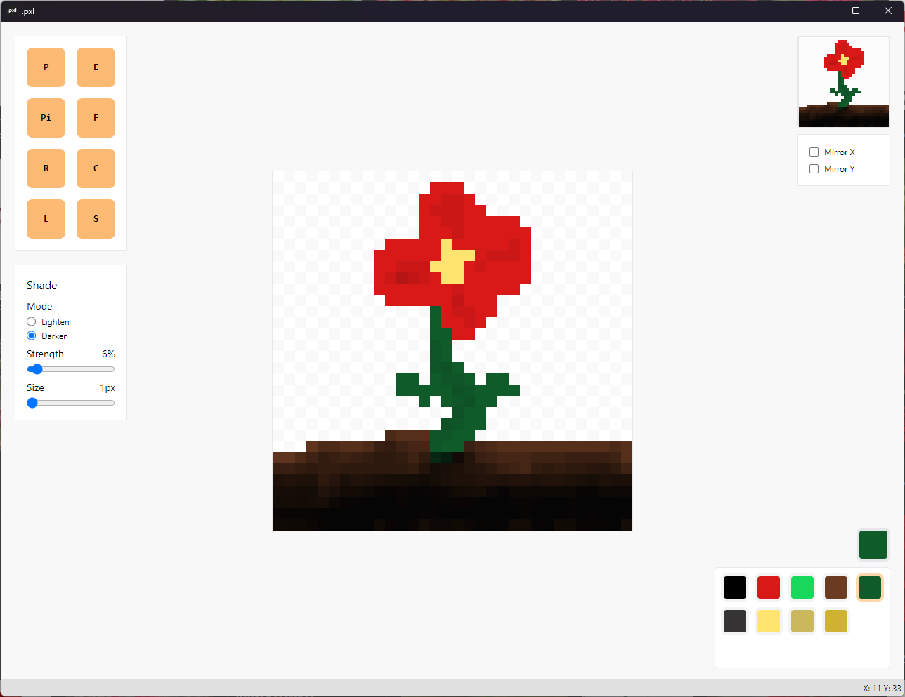

  
   
  <a href="https://sharvenp.github.io/pxl/">.pxl (beta)</a>
   
   
  A pixel art editor powered by <a href="https://pixijs.com/">PixiJS</a> and <a href="https://vuejs.org/">Vue</a>.
    
  

# Todo List

  - Layer transpaerncy and effects
  - Dark mode
  - Resizable and movable panels
  - Customizable keybinds
  - Gradient tool

# License

[MIT License](https://github.com/sharvenp/pxl/blob/main/LICENSE)

----

WIP Timeline

### Update: December 13, 2025

### Update: March 30, 2025

### Update: August 9, 2024

